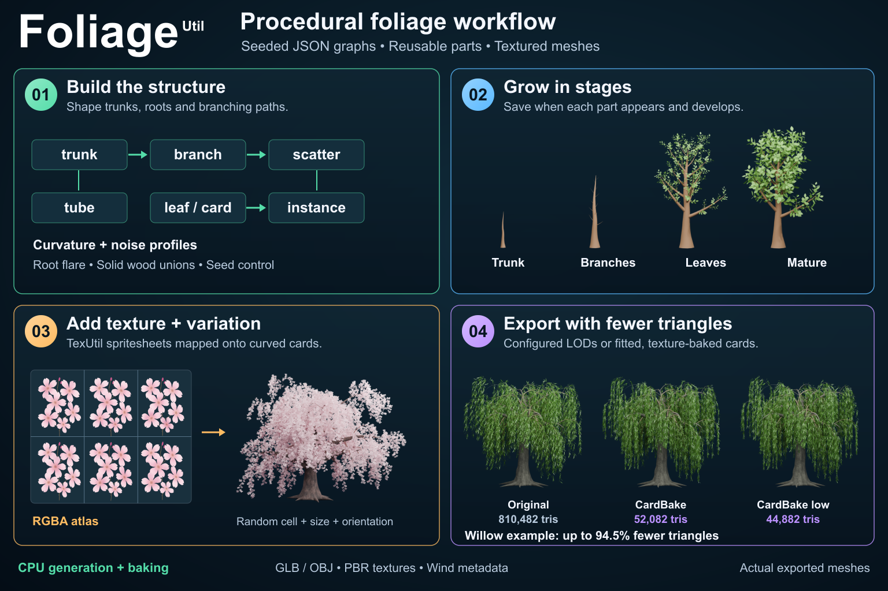
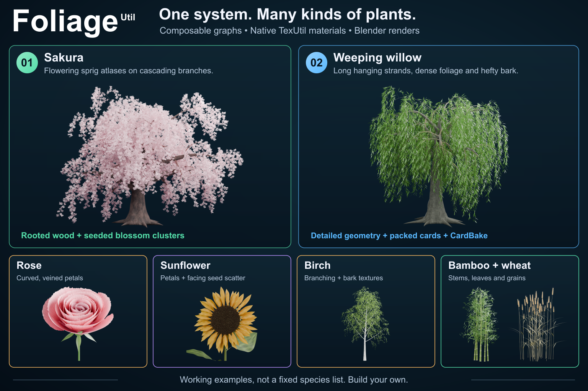

# FoliageUtil

Generate seeded foliage, rock and crystal meshes from small JSON graphs. C++17, CPU generation,
OBJ/MTL and self-contained GLB exports, with controls discoverable by AI agents.





Explore the [sample graphs](samples/README.md), the new [sakura study](docs/SAKURA.md),
or the [GitHub social image and editable publication sources](docs/SOCIAL.md).

Build plants from reusable **growth paths → placements → geometry**. Trees,
bushes, logs, reeds, wheat, bamboo, flowers, roses and rosettes are working example
graphs. They are not built-in species or a closed list of supported plants. Use
these same nodes for roots, vines, grasses, succulents, seed heads, fruit, thorns,
coral-like structures, or your own mesh prototypes.

This is a working v0.1 foundation, not feature parity with SpeedTree. It includes
24 composable node types, deterministic branching and scattering, curved surfaces,
configured LOD exports, staged growth snapshots, cards, material slots and wind metadata. See the concrete
limitations below.

## Build and run

CMake 3.29+ (3.24+ with `FOLIAGE_ALEMBIC=OFF`), a C++17 compiler, libpng development files (with zlib), and an
internet connection for the first configure are required. Ninja is optional. CMake fetches pinned nlohmann/json 3.12.0 and
Manifold 3.5.3 for JSON parsing and solid unions. Manifold is linked statically;
libpng provides PNG decoding and writing for CardBake. There is no Python,
graphics or TexUtil runtime dependency for generation or baking.
See [third-party notices](docs/THIRD_PARTY.md).

Textured samples are source-only in Git. Prepare their portable assets with an
existing TexUtil executable after building; the [sample guide](samples/README.md)
explains the layout. CTest uses small generated diagnostic fixtures and needs
Python 3 when `BUILD_TESTING` is enabled. It does not require TexUtil.

```sh
cmake -S . -B build -G Ninja -DCMAKE_BUILD_TYPE=Release
cmake --build build --parallel 8
ctest --test-dir build --output-on-failure
python3 tools/prepare_samples.py --texutil ../TexUtil/build/texutil

./build/foliageutil out/samples/graphs/tree.json --out out/tree
./build/foliageutil out/samples/graphs/rose.json --out out/rose --seed 123 --json
./build/foliageutil validate out/samples/graphs/bamboo.json --json
./build/foliageutil nodes --json
./build/foliageutil describe radial
```

On Windows, install libpng through your dependency manager and expose it to
CMake (for example through a vcpkg toolchain). Use a Visual Studio 2022 Developer PowerShell:

```powershell
cmake -S . -B build-windows -G "Visual Studio 17 2022" -A x64
cmake --build build-windows --config Release --parallel 8
ctest --test-dir build-windows -C Release --output-on-failure
.\build-windows\Release\foliageutil.exe samples\graphs\rose.json --out out\rose
```

macOS ARM64 is tested. Windows and Linux builds have not been verified.

`generate` is optional. A recipe filename of `-` reads stdin, with assets relative
to the current directory. File recipes resolve assets relative to the recipe.
Output filenames are relative to `--out`, which defaults to `out`. Existing output
files are overwritten. Export is not an atomic batch; a later failure can leave
earlier files. Inputs cannot be overwritten by graph outputs. Success exits 0;
validation, generation and I/O errors exit 1 on stderr. `--json` provides structured
results including counts, bounds, materials and per-node timings.

## Graph model

```json
{
  "version": 1,
  "seed": 42,
  "nodes": {
    "stem": {"op": "trunk", "length": 2, "radius": 0.08},
    "branches": {"op": "branch", "input": "stem", "count": 8, "length": 0.7},
    "paths": {"op": "merge", "inputs": ["stem", "branches"]},
    "wood": {"op": "tube", "input": "paths", "sides": 8},
    "sites": {"op": "scatter", "input": "branches", "count": 10},
    "leaf": {"op": "leaf", "length": 0.2, "width": 0.09},
    "leaves": {"op": "instance", "input": "leaf", "points": "sites"},
    "plant": {"op": "merge", "inputs": ["wood", "leaves"]}
  },
  "outputs": {"plant.glb": "plant", "plant.obj": "plant"}
}
```

Names are references, object order does not affect evaluation, and shared nodes
execute once. Every node is validated, including unused nodes; only nodes reachable
from outputs execute. Cycles, missing references, incompatible types, unknown
parameters, unsupported versions, invalid ranges and unknown materials fail early.
`validate` checks graph structure and asset existence, not full OBJ/image decoding
or whether the eventual geometry fits the generation budgets.

| Value | Meaning | Typical operations |
| --- | --- | --- |
| `skeleton` | One or more sampled centerlines with radii and branch depth | `trunk`, `curve`, `branch`, `roots`, `grow`, `prune`, `transform`, `merge` |
| `points` | Positions with orientation frames, uniform scale and random phase | `scatter`, `radial`, `orient`, `transform`, `merge` |
| `mesh` | Triangles, normals, UVs, material slots, colors and wind data | `tube`, `leaf`, `card`, `ellipsoid`, `mesh`, `instance`, `material`, `wind`, `transform`, `merge` |

A `branch` node returns **new children only**. Chain branch nodes for additional
generations, then merge the paths you want to sweep. `instance` takes any mesh,
including a branch cluster, full flower or complete plant, and flattens copies onto
placement frames. An instance reuses the prototype's shape; generate different
recipe seeds for independently grown variants.

`grow` retains an arc-length fraction of each stem and applies directional tropism
from that stem's base. Run it **before attaching children**. Paths do not retain
parent constraints: growing an already merged tree can detach branches. `prune`
selects whole stems by tip position, not by cutting faces or solving collisions.

The [node reference](docs/NODES.md), [machine-readable catalog](docs/nodes.json),
and `describe OP` list exact parameter names, defaults, types and limits.

## Working examples

| Recipe | Demonstrates |
| --- | --- |
| [rocks, cliffs and crystals](docs/MINERALS.md) | Seeded stone shapes, Boolean carving, faceted gems and crystal clusters |
| [rooted-tree.json](samples/graphs/rooted-tree.json) | Fused trunk, branches and roots, fading profiles, and TexUtil bark |
| [tree](samples/graphs/tree.json) | Trunk, two branch generations, geometry leaves, UVs and wind weights |
| [birch](samples/graphs/birch.json) | Existing TexUtil birch bark, three branch generations, drooping twigs and twelve translucent leaf sprites |
| [weeping-willow](samples/graphs/weeping-willow.json) | Arched boughs, profiled hanging strands, attached narrow leaves and seeded atlas variants |
| [bush](samples/graphs/bush.json) | Branching shoot assembled into a scattered shrub |
| [log](samples/graphs/log.json) | Horizontal growth, branch stubs, bark and cut-end slots |
| [reeds](samples/graphs/reeds.json) | Curved blades, seed heads and ground clumps |
| [wheat](samples/graphs/wheat.json) | Textured golden patch, three seeded stalk shapes, attached ears, pointed husks and fine awns |
| [bamboo](samples/graphs/bamboo.json) | Seven textured culms, pale joint bands, eight leaf atlas variants and overlapping culm/branch/baby-leaf growth |
| [lily-pad](samples/graphs/lily-pad.json) | Gently cupped cards, notched stencils, six vein/pigment variants and submerged petioles |
| [flower](samples/graphs/flower.json) | Radial petals, ellipsoid center, leaves and stem |
| [rose](samples/graphs/rose.json) | Petals cup inward and overlap along a radial spiral |
| [rose-detailed](samples/graphs/rose-detailed.json) | Denser geometry, three inward-cupped petal layers, compound leaves and TexUtil maps |
| [plant](samples/graphs/plant.json) | A basal rosette using the same spiral placement nodes |
| [development-tree](samples/graphs/development-tree.json) | Overlapping stem extension, independent thickening and baby leaves triggered by reached attachments |
| [cards](samples/graphs/cards.json) | Cheaper branch tubes and crossed atlas cards |
| [cards-outward](samples/graphs/cards-outward.json) | Single cards facing outward from a canopy pivot, with seeded angular variation |
| [card-orientations](samples/graphs/card-orientations.json) | Side-by-side crossed, outward and randomized outward cards |
| [card-variation](samples/graphs/card-variation.json) | Alpha stencils on identical, independently resized and curved cards |
| [cards-spritesheet](samples/graphs/cards-spritesheet.json) | Fixed, cycling and seeded random TexUtil atlas cells with matching PBR maps |

The [weeping willow guide](docs/WILLOW.md) explains hanging branch profiles,
attachment order, shared atlas materials, rendering and density controls.

The rose uses `leaf` with `shape:"petal"`, additional width subdivisions, curl,
fold and twist. `radial` in `spiral` mode places 38 petals at approximately the
golden angle (137.50776 degrees). Radius increases outward while height decreases;
inner petals are smaller and more upright. Adjust these curves with the start/end
pairs in the recipe. The flower and rosette reuse these controls with other values.

### Geometry density

There is no general subdivision-surface modifier or global subdivision level.
Increase geometry directly at each generator:

| Part | Controls | Supported range |
| --- | --- | --- |
| Leaf or petal | `segments` along length, `width_segments` across width | 2..128 and 2..32 |
| Card | `segments` along height, `width_segments` across width | 1..128 and 1..32 |
| Trunk or branch path | `segments` | 1..512 |
| Tube | `sides` around each ring; `stride:1` retains all path samples | 3..128 sides |
| Bud or grain | `rings` and `sides` | 3..128 each |

The detailed rose uses `segments:40` and `width_segments:16` for its petals.
These samples follow the procedural surface; no Blender subdivision modifier is
needed to obtain the denser result. Increasing path `segments` can also change a
stochastic growth path, since its random walk takes more steps.

For the inward curl of rose petals, negative **`fold`** bends the side edges toward
the center of the bloom when placed by `radial`. Negative **`curl`** bends the tip
inward along its length. They control different directions. The detailed recipe
uses three overlapping spiral layers with separate size, tilt, fold and curl.

[The rose study](docs/ROSE.md) includes TexUtil material recipes and Blender Cycles
renders of the actual exported mesh.

[The birch study](docs/BIRCH.md) reuses TexUtil's birch log material on a seeded
tree with a pointed, toothed leaf atlas. Its materials and leaf optics are embedded
in GLB, and the prepared maps let it generate without TexUtil installed.

[The wheat study](docs/WHEAT.md) includes the 36-stalk patch plus separate stem and
ear exports for close inspection. [SOCIAL.md](docs/SOCIAL.md) explains how the README
banner is rendered from the birch, bamboo, rose and wheat GLBs,
arranged on the right and cropped at the bottom edge.

[The bamboo study](docs/BAMBOO.md) aligns textured joint bands with raised culm
rings. [The lily pad study](docs/LILY_PAD.md) separates curved geometry from the
notched alpha stencil and vein maps. Both include actual Blender renders, TexUtil
source recipes and graphs for separate detail exports.

[Scatter proximity](docs/SCATTER_PROXIMITY.md) can reject placements that are too
far from supporting geometry and snap nearby pivots onto its triangle surfaces.
The bamboo example uses it to keep leaf bases attached to its branch mesh.

[Rooted trunks and profiles](docs/ROOTS.md) adds spreading roots with attachment,
reach, thickness, meander and burial controls. Radius profiles, adjustable flare
falloff, fading lobes and coherent radial noise shape irregular trunks. Root tips
descend below an explicit ground height. [Solid mesh unions](docs/SOLIDS.md) fuse
closed trunk, root and branch shells with `solidify`, retaining materials and UVs.
The rooted-tree example includes TexUtil bark maps and Blender renders.

## Determinism and limits

The default root seed is 42. `--seed N` overrides it; an explicit node `seed`
is independent of the root. Each node's stream combines the seed with a stable
hash of its name, using a specified SplitMix64 generator rather than implementation-
defined standard distributions. Adding unrelated nodes or reordering JSON keys
does not perturb existing geometry. Renaming a stochastic node intentionally changes
its stream. Geometry and exports are byte-repeatable for the same recipe, assets,
seed and build. Floating-point math may differ across compilers/platforms; there is
no cross-platform bitwise promise. Timing statistics are naturally variable.

Limits are 8 MiB JSON, 512 nodes, 64 outputs, 256 custom materials, and 64 MiB per
imported OBJ or texture. Each evaluated node charges its generated geometry,
including copies made by merge/transform/instance. Defaults are 4 million vertices,
4 million triangles and 500,000 combined path samples/scatter points. Override via
`--max-vertices`, `--max-triangles`, `--max-points` (1..100 million each). Charges
happen before large replication, so multiplicative branching fails with a named
node error instead of silently exhausting memory. These are data-count budgets,
not a total process memory cap.

## Materials, UVs and game assets

Geometry uses meters, right-handed Y-up, and counterclockwise front faces. Local
prototype +Y is its growth direction. Positive local +Z is the leaf face normal;
radial placements turn that face outward. Euler rotations apply X, then Y, then Z.

Tubes have a continuous seam, circumference U and arc-length V. Caps have separate
vertices, flat normals, disk UVs and a `cap_material` slot. Leaves have normalized
UVs; cards support `uv_rect:[u0,v0,u1,v1]`. UVs intentionally repeat across foliage
parts. They are suitable for tiled bark and leaf atlases, not a unique whole-model
bake atlas. OBJ uses bottom-origin V; GLB flips V to the glTF image convention.

Define material slots at the document root:

```json
"materials": {
  "leaves": {
    "base_color": [1, 1, 1, 1],
    "base_color_texture": "textures/leaves.png",
    "roughness": 0.8,
    "double_sided": true,
    "alpha_mode": "MASK",
    "alpha_cutoff": 0.5
  }
}
```

Assign that name through a geometry node's `material` field or the `material`
node. Built-in slots are `bark`, `cut`, and `leaf`; custom names must be declared.
Numeric colors are **linear RGBA**, texture base colors are **sRGB**, and normal
and metallic/roughness maps are linear data. Optional `normal_texture` uses the
OpenGL tangent-space convention; `metallic_roughness_texture` packs roughness into
G and metallic into B. `roughness` and `metallic` multiply the respective texture
channels. A metallic map therefore needs a nonzero `metallic` multiplier.

GLB embeds PNG/JPEG textures, PBR materials, `COLOR_0` variation and a custom
`_WIND` VEC2 (bending weight, phase in cycles). It is a static mesh: engine shader
code must implement wind and consume that attribute, and importers may discard
custom attributes. Tangents are not exported; the destination should generate them
when using normal maps. OBJ writes MTL and copies base-color/normal textures into
a companion folder; it does not preserve vertex colors, wind, glTF alpha modes,
or a packed metallic/roughness texture. GLB is the richer exchange format.

For cheaper geometry, reduce `tube.sides`, increase `tube.stride`, reduce leaf
subdivisions or scatter counts, and replace a leaf prototype with `card`.
The supplied tree is 37,622 triangles; its card recipe is 6,410. These are separate
recipes and exports, not an automatic LOD chain. The card examples include a procedural alpha-cutout leaf PNG embedded in GLB.
TexUtil solid-color previews still show their rectangular geometry. Card generation
does not bake a high-detail canopy into an impostor atlas. Use the separate
[CardBake export](docs/CARD_BAKE.md) to project generated strands onto fitted cards.

### Card orientation

Set `card.planes:2` for crossed cards, or `1` for one plane. Independently, insert
`orient` between placement and instancing:

```json
"facing": {
  "op": "orient",
  "input": "attachments",
  "mode": "outward",
  "center": [0, 3.5, 0],
  "horizontal": false,
  "rotation_jitter": [10, 25, 15]
},
"leaves": {"op": "instance", "input": "leaf", "points": "facing"}
```

`orient` aims the card's **+Z face normal**. `outward` points away from the chosen
pivot; `inward` faces toward it, `fixed` uses `direction`, and `keep` preserves
incoming attachment orientation before adding variation. `horizontal:true`
projects radial facing onto the plane perpendicular to `up`, keeping cards upright
around the pivot. False follows the full 3D vector, useful for a rounded canopy.

`rotation_jitter` is seeded **+/- local XYZ degrees**, applied after alignment.
Y varies facing, X adds pitch, and Z adds roll. `[0,0,0]` gives exact alignment.
At the pivot, where outward is undefined, `direction` supplies a stable fallback.
Crossed cards rotate as a unit: the first plane follows the requested facing and
remaining planes retain their crossing angles. The node works with any prototype.

### Stretch and shape textured cards

`instance.scale_jitter:[0.10,0.15,0]` gives each copy an independent width multiplier
of 0.90..1.10 and height multiplier of 0.85..1.15. Z controls prototype depth and
has no effect on a flat XY card. These local-axis changes happen around the
prototype origin before instance rotation and placement. UVs remain attached, so
the image stretches with the surface. Normals use inverse scale for correct lighting.
The same seed repeats the result; zero variation preserves the original sizes.
Size variation has a separate random stream from vertex-color variation.

For real bending, use `card.segments` and `card.width_segments` with `curl`, `fold`
and `twist`. Defaults remain one flat quad per plane. Curl and twist require at
least two height segments, while fold requires at least two width segments.
The pivot stays anchored and `uv_rect` still selects the stencil's atlas region.
Crossed planes are shaped separately before their crossing rotations. These shape
controls define the prototype; `scale_jitter` then resizes each copy. It does not
independently randomize the prototype's fold or curl parameters.

See [card-variation.json](samples/graphs/card-variation.json) and the
[leaf/petal surface design](docs/SURFACES.md) for the division between geometry,
stencils and translucency.

For sprite variation, add `atlas:"../assets/spritesheets/leaves.atlas.json"` and
`atlas_mode:"random"` to `instance`, then bind the manifest's atlas PNGs in the
material. Cell bounds and padding come from the shared manifest. `"cycle"` visits
every occupied cell; `"fixed"` uses `atlas_index`. See [spritesheets](docs/SPRITESHEETS.md).

## Bake generated foliage onto fitted cards

`--card-bake NAME` exports fitted cards baked from the actual source mesh, with
unique color/alpha, normal and metallic/roughness atlas cells for each path and
plane. The original willow becomes **52,082 triangles**, or **44,882** with three
segments per card, while retaining the 37,682-triangle welded wood.

```sh
./build/foliageutil out/samples/graphs/weeping-willow.json --card-bake Strands --out out/willow-card-bake-final --json
./build/foliageutil out/samples/graphs/weeping-willow.json --card-bake StrandsLow --out out/willow-card-bake-final --json
./build/foliageutil card-bakes --json
```

Save profiles in root `card_bakes`. Ordinary generation remains unchanged; baking
runs only when selected. See [CardBake](docs/CARD_BAKE.md) for source/guide setup,
resolution controls, packaging, material support and projection limitations.

## Packed foliage cards

Use whole leafy sprays on curved, crossed `ribbon` strips to retain a dense canopy
with much less topology. The packed willow has **52,082 triangles**, down from
810,482; its lower levels have 44,882 and 40,082. The same welded trunk and wood
are retained. See [packed-card controls and tradeoffs](docs/PACKED_CARDS.md).

```sh
./build/foliageutil out/samples/graphs/weeping-willow.json --out out/willow-cards --lod Cards
./build/foliageutil out/samples/graphs/willow-tree-card-packed.json --out out/willow-tree-card-packed
```

## LOD exports and growth stages

Save named `lods` profiles to reduce instance density, tube sides/stride and
leaf/card subdivisions during export. Per-node overrides preserve essential
support geometry. Seeded survivors retain their atlas cells and variation.
The willow exports at **810k / 311k / 211k triangles**. See [LOD controls](docs/LOD.md).

Root `growth.stages` schedules nodes by start/end progress. Grow a trunk first,
branches from 40%, and leaves from 75%. Each leaf, pod or flower instance grows
at its own attachment. `growth.steps` exports independent snapshots and a portable
manifest. See [growth controls](docs/GROWTH.md) and
[the growth-tree example](samples/graphs/growth-tree.json).

Use `growth.mode:"developmental"` for simultaneous growth along mature guide paths.
Separate `length_profile` and `radius_profile` channels extend and strengthen stems;
branches emerge when the parent reaches their attachment. Leaves and flowering
sprigs use attachment-relative `scale_profile` channels for baby phases. See
[developmental growth](docs/GROWTH.md#developmental-growth) and the revised
[sakura animation](docs/SAKURA.md#growth-animation).

```sh
./build/foliageutil out/samples/graphs/growth-tree.json --out out/growth-tree
./build/foliageutil out/samples/graphs/growth-tree.json --out out/step --growth-step 7 --lod LOD1
./build/foliageutil out/samples/graphs/growth-tree.json --out out/mature --no-growth --no-lods
./build/foliageutil lods --json
./build/foliageutil growth --json
```

The [sunflower example](samples/graphs/sunflower.json) combines a domed seed head,
front-facing scatter, curved petals with a TexUtil variation atlas, and separate
leaf/flower/petal/seed growth stages. `scatter.normal_direction` and
`max_surface_angle` select the facing surface; `angle:0` aligns each seed's +Y
with its normal. [Sunflower controls and render](docs/SUNFLOWER.md).

## Reuse TexUtil

FoliageUtil supplies the mesh; TexUtil supplies its existing texture graphs,
xatlas unwrapping, geometry-map baking, MaterialX output and optional Filament
previews. No TexUtil sources or SDKs are duplicated. See
[the integration workflow](docs/TEXUTIL.md).

```sh
python3 tools/preview.py out/samples/graphs/rose.json --texutil ../TexUtil/build/texutil --out out/rose-preview
python3 tools/gallery.py --texutil ../TexUtil/build/texutil
```

These optional Python helpers generate actual Filament renders of the exported
meshes using solid material colors. They require an already built, GPU-enabled
TexUtil. They do not preview alpha cutouts, texture bindings, vertex colors or wind.

For a Blender render that uses the actual GLB materials and embedded textures:

```sh
./build/foliageutil out/samples/graphs/rose-detailed.json --out out/rose-detailed
blender --background --factory-startup --python-exit-code 1 --python tools/render_blender.py -- --model out/rose-detailed/rose-detailed.glb --out out/rose-detailed/rose.png --hdr ../TexUtil/assets/hdri/studio.hdr
```

Use your installed Blender executable; see [the rose study](docs/ROSE.md) for the
macOS path and close-up settings. The optional script saves a packed `.blend` and a
render-settings manifest alongside the PNG. It does not modify the exported geometry.
Saved material fields `translucency`, `translucency_color`, `subsurface`,
`subsurface_scale` and `subsurface_radius` now drive the Blender preview automatically.
They travel in versioned GLB `extras.foliageutil`; other viewers require an adapter.
Alpha coverage still defines stencil holes independently. Discover their schema with
`foliageutil materials --json` or read [MATERIALS.md](docs/MATERIALS.md).
`--petal-subsurface` remains an optional preview override; zero disables saved petal
subsurface. `--lighting backlit` helps inspect tissue transmission.

The [detailed rose](samples/graphs/rose-detailed.json) now combines twelve TexUtil petal
sprites, curved cards, seeded size variation and those saved optical controls.
The [single-petal study](samples/graphs/petal-study.json) uses the same atlas and material.

## Current boundaries and extensions

Branch tubes overlap their parent until passed through `solidify`. Its boolean
union makes closed wood, but does not bevel crotches, fill gaps, repair arbitrary
self-intersections or turn leaf cards into volumes. There is no collision avoidance, light competition, botanical growth
simulation, automatic seasonal progression, UV atlas baking, high-to-low baking,
impostor generation, geometry decimation, runtime editor, GPU instancing, skeleton
animation or FBX export. Bamboo rings are raised solid culms, not hollow internodes.
OBJ imports support static convex faces and one replacement material. JSON graph
imports and parameterized species presets are not implemented yet.

The core library in `include/foliage/foliage.hpp` separates validation, generation
and export. Add new primitives or growth operators by extending the central
catalog, type rules if needed, and evaluator. Existing graphs can combine them
without creating a dedicated generator for each species.

See [validation evidence](docs/VALIDATION.md) and [third-party notices](docs/THIRD_PARTY.md).

## Source and generated files

`samples/` contains the foliage and TexUtil source recipes. `out/samples/` is the
portable prepared bundle; other `out/` directories contain generated models and
renders. Generated media, models, bakes, build trees and archives are ignored.
Only the two README graphics and the social JPEG belong in `docs/images/`.
Individual sample renders and close-ups stay under `out/`; the linked sample
guides describe how to reproduce them.

See [repository storage and cleanup](docs/REPOSITORY.md). CTest now discards
successful test exports instead of accumulating gigabytes of duplicate assets.

### Growth animation and game stages

Export native Alembic growth caches with portable material maps, or independent
GLB stages using geometry, CardBake, or a mix. Saved `exports` profiles control
frame/step counts, progress range, LOD and per-stage representation. See
[the export guide](docs/EXPORTS.md) for Blender and Unity workflows and
`foliageutil exports --json` for the schema. The Sakura growth recipe includes
`Animation`, `GeometryStages`, `CardStages` and `MixedStages` profiles.

### Live Unity generation

The [Unity package](docs/UNITY.md) calls the same C++ graph engine through a C#
wrapper. Change seed, growth or LOD in a component; generation, tangents and bounds
run on a worker while Unity applies the completed mesh. A saved CardBake profile
can fit and bake a lower-triangle result, including its textures. Enable **Reuse
Mature Card Bake** on a developmental recipe to bake once and grow the fitted cards
with shared textures. The inspector separates preparation, worker and main-thread
apply timings. See [reusable card growth](docs/UNITY.md#reuse-mature-cards-for-live-growth)
for its shoot-level approximation and cache lifetime.

Build the package with `python3 tools/build_unity_package.py` on each target OS.
macOS supports a universal Apple Silicon/Intel binary; Windows and Linux use
separate x64 builds. Recipe/texture bundles are portable across those builds.
